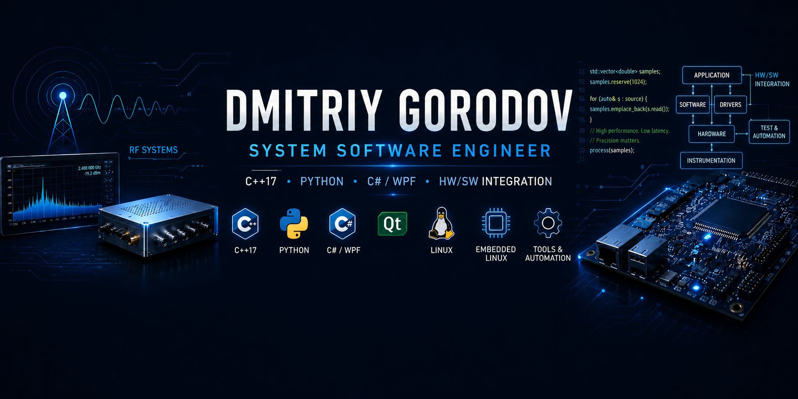

  
  
  <h3>  
    Hi there, I'm Dmitriy Gorodov 👋  
  </h3>  

  ### System Software Engineer · C++17 / Qt · Python Automation · C# / WPF · HW/SW Integration

  **Open to roles in system software, embedded software, hardware-software integration, C++, and Python automation.**

---

## About Me

System Software Engineer with hands-on experience building software for RF signal generator platforms, engineering tools, calibration and validation workflows, automated test environments, and hardware-software integration.

I work across Windows, Linux, and Embedded Linux environments, with a focus on maintainable software that interacts closely with real hardware. My core background includes C++17, Python, C#, Qt, WPF, RF measurement workflows, device communication protocols, and cross-layer debugging involving software, firmware, FPGA, and hardware.

---

## 🤝 Connect with Me

---

## 💼 Core Skills

**Languages:** C++17, C, Python, C#, Bash, SQL  
**Frameworks & Desktop:** Qt, PySide6, .NET WPF, MVVM, OOP, Multithreading  
**Systems:** Linux, Embedded Linux, Windows  
**Hardware & Interfaces:** HW/SW Integration, Embedded Systems, FPGA Interaction, Firmware Interaction, RF Devices  
**Protocols & Communication:** TCP/IP, UDP, SCPI, SSH/SFTP, SPI, USB/LAN, Register-Level Control  
**Tools & Workflow:** Git, GitHub, Visual Studio, VS Code, Linux CLI, NI-VISA, Jira, Agile

---

## 🛠️ Experience Highlights

- Develop C++17/Qt, Python, and C#/.NET WPF software for RF signal generator platforms
- Build engineering applications across Windows, Linux, and Embedded Linux environments
- Design calibration, validation, diagnostics, and data-processing tools for RF measurement workflows
- Develop Python-based automated test environments for RF validation, instrument control, regression testing, log generation, plot/report creation, and failure analysis
- Implement device communication and configuration flows using TCP/IP, UDP, SCPI, SSH/SFTP, SPI, USB/LAN workflows, and register-level hardware access
- Build modular desktop tools with OOP, MVVM-style design, worker-thread execution, responsive UI workflows, and separation between UI, backend logic, and device communication layers
- Debug issues across application software, Linux services, embedded firmware, FPGA-controlled subsystems, operating systems, and hardware interfaces
- Work with lab equipment such as RF signal generators, power meters, spectrum analyzers, and counters
- Achieved absolute power accuracy of ±0.8 dB across 20–40 GHz from −40 dBm to +10 dBm through calibration analysis and validation
- Former Israeli Air Force Avionics Technician, recognized with Honors for outstanding performance and attention to detail

---

## 🚀 Featured Experience

### RF Signal Generator Calibration, Validation & Diagnostic Tools

Developed C++17/Qt and Python tools for calibration, diagnostics, automated testing, service workflows, and RF measurement analysis.

**Main areas:**
- Calibration file processing
- Measurement-data analysis
- Frequency and power validation
- Automated decision flows
- Plot and report generation
- Device reconnect and recovery workflows
- Remote Linux interaction through SSH/SFTP
- Debugging across software, firmware, FPGA, and hardware layers

### Python Automated Test & Measurement Environment

Developed a Python-based automation environment for RF validation tests, device and instrument orchestration, repeatable regression workflows, and failure analysis.

**Main areas:**
- SCPI-controlled instrument communication
- RF device control
- Automated measurement flows
- Logs, plots, and reports
- Regression checks
- Faster debugging of measurement failures

### C# / WPF RF Device Configuration Application

Developed a desktop application for configuring RF devices according to customer-specific requirements and required device behavior.

**Main areas:**
- RF parameter configuration
- Customer-specific setup workflows
- Input validation
- Error handling
- MVVM-style architecture
- Separation between UI, business logic, and device communication
- Responsive desktop operation

### Low-Level Device Communication & System Integration

Developed utilities and software components for communication, diagnostics, and orchestration of embedded RF platforms.

**Main areas:**
- SPI-based communication
- Register-level configuration
- Embedded Linux workflows
- FPGA / firmware interaction
- Linux services
- Multithreaded flows
- Cross-layer root-cause debugging

---

## 🎓 Education

**B.Sc. Computer Science**  
The Open University of Israel | 2023–2026

**Relevant areas:**
- Operating Systems
- System Programming
- Computer Architecture
- Computer Networks
- Data Structures and Algorithms
- Embedded Systems
- Software Architecture

---

## 🌍 Languages

- Hebrew — Native
- Russian — Native
- English — Fluent, technical and professional

---

## 📈 GitHub Stats

